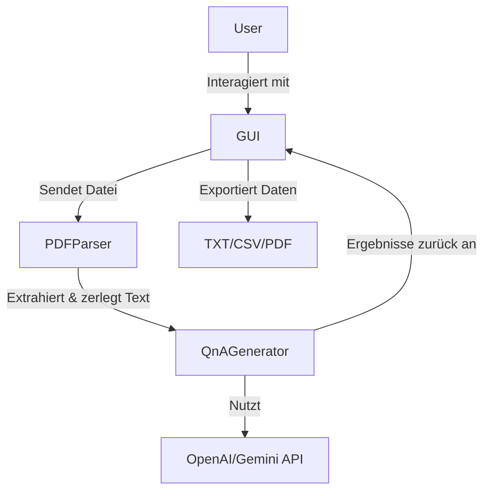

# Systemarchitektur

## Übersicht
Die Architektur des Karteikarten-Generators basiert auf einer modularen Struktur, die verschiedene Komponenten für die PDF-Verarbeitung, die Generierung von Frage-Antwort-Paaren und die Benutzeroberfläche integriert. Die Software nutzt sowohl lokale Verarbeitung als auch externe APIs für die NLP-Generierung.

## Komponenten
Das System besteht aus folgenden Hauptkomponenten:

### 1. **GUI (Graphical User Interface)**
- Implementiert mit **PyQt6** und bietet eine Stepper-basierte Navigation.
- Ermöglicht den Upload von PDFs, die Auswahl der API sowie die manuelle Bearbeitung der generierten Karteikarten.
- Besteht aus mehreren Ansichten (Dateiauswahl, Verarbeitung, Ergebnissichtung und Export).

### 2. **PDF-Parser**
- Nutzt **PyMuPDF (fitz)** zur Extraktion und Analyse von PDF-Dokumenten.
- Zerlegt den extrahierten Text in sinnvolle Chunks basierend auf Überschriften und Absätzen.
- Bereitet den Text für die NLP-Verarbeitung vor.

### 3. **QnA-Generator**
- Unterstützt zwei NLP-Modelle: **OpenAI GPT** und **Google Gemini**.
- Generiert automatisch Fragen und Antworten auf Basis der extrahierten PDF-Inhalte.
- Unterstützt auch eine manuelle Bearbeitung der Fragen und Antworten.

### 4. **API-Integration**
- Sendet Textabschnitte an OpenAI/Gemini zur Generierung von QnA-Paaren.
- Empfangt Antworten und filtert fehlerhafte oder nicht relevante Inhalte.

### 5. **Datenexport**
- Unterstützt die Speicherung der generierten Karten als **TXT, CSV (Anki-kompatibel) und PDF**.
- Verwendet die **fpdf**-Bibliothek zur PDF-Erstellung.

## Architekturdiagramm
Ein **C4-Container-Diagramm** gibt einen Überblick über die Interaktion zwischen den Komponenten:

## Datenfluss
1. **User lädt PDF hoch → GUI sendet an PDFParser**
2. **PDFParser analysiert das Dokument, erstellt Chunks → Übergibt an QnAGenerator**
3. **QnAGenerator entscheidet über API-Nutzung (OpenAI/Gemini) oder manuelle Bearbeitung**
4. **Generierte Fragen & Antworten werden in der GUI angezeigt → User kann sie bearbeiten**
5. **Export der finalen QnA-Karten in TXT, CSV oder PDF**

## Fazit
Diese Architektur ermöglicht eine **skalierbare und modulare Lösung** für die automatische Erstellung von Karteikarten aus PDF-Dokumenten. Durch die Trennung von GUI, Parser und NLP-Logik bleibt das System flexibel erweiterbar.
