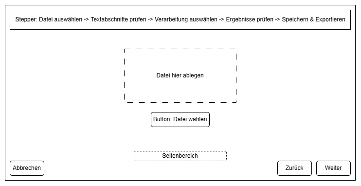
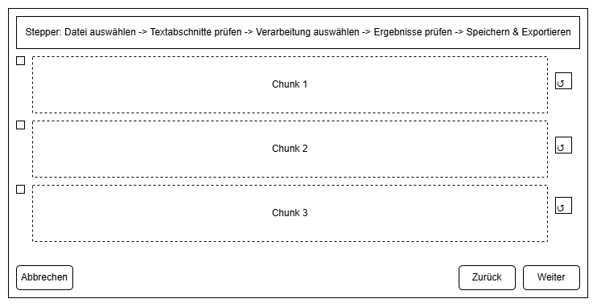
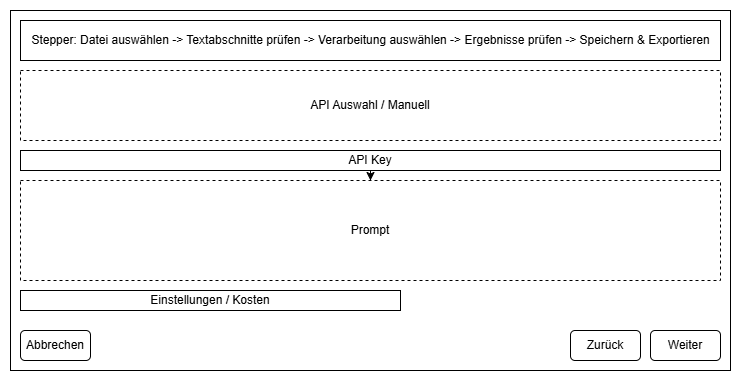
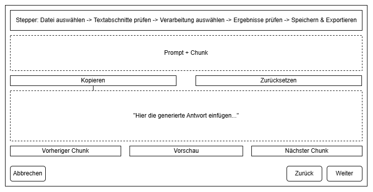
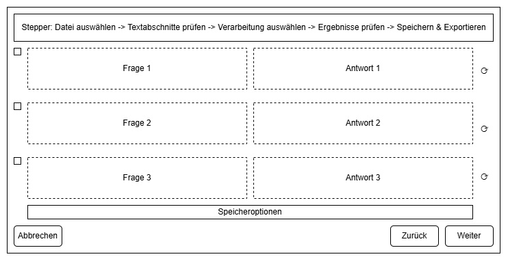

# Benutzeranleitung

## Einführung
Der Karteikarten-Generator ermöglicht die Erstellung von Frage-Antwort-Karten aus PDF-Dokumenten. Die Anwendung bietet eine intuitive, schrittweise Navigation und unterstützt sowohl automatische als auch manuelle Generierung von Karteikarten.

## Systemanforderungen
- Betriebssystem: Windows, macOS, Linux
- Python 3.8 oder höher
- Abhängigkeiten aus `requirements.txt`

## Installation
1. Python installieren (falls nicht vorhanden).
2. Projekt-Repository klonen:
   ```sh
   git clone https://github.com/MTatzel/ki-karteikarten-generator
   cd karteikarten-generator
   ```
3. Abhängigkeiten installieren:
   ```sh
   pip install -r requirements.txt
   ```

## Anwendung starten
```sh
python src/main.py
```

## Bedienung
Die Benutzeroberfläche besteht aus mehreren Schritten:

### 1. **PDF-Datei hochladen**
- Ziehe eine Datei in das Fenster oder nutze die Schaltfläche „Datei auswählen“.
- Wähle den Seitenbereich für die Verarbeitung aus.

### 2. **Textanalyse und Chunking**
- Die Software analysiert das PDF und teilt es in verarbeitbare Abschnitte (Chunks) auf.
- Überprüfe die extrahierten Abschnitte und passe sie ggf. an.

### 3. **Verarbeitung auswählen**
- Wähle die Art der Generierung:
  - **Manuelle Erstellung**: Der Benutzer kann den vorbereiteten Prompt inklusive Chunk kopieren und manuell in eine externe KI (z. B. ChatGPT oder Gemini) eingeben. Die generierte Antwort wird anschließend zurück in die Anwendung eingefügt. Danach kann der nächste Chunk bearbeitet werden.
  - **KI-gestützte Erstellung**: Die Anwendung sendet die Chunks automatisch an OpenAI oder Google Gemini, um Fragen und Antworten zu generieren. ⚠ Hinweis: Die Nutzung externer APIs kann Kosten verursachen, insbesondere bei großen Dokumenten oder hoher Token-Anzahl.

### 4. **Ergebnisse überprüfen**
- Die generierten Fragen und Antworten werden angezeigt.
- Fragen können bearbeitet oder entfernt werden.

### 5. **Speichern und Exportieren**
- Exportoptionen:
  - **TXT**: Einfache Textdatei mit Frage-Antwort-Paaren.
  - **CSV**: Kompatibel mit Anki für digitale Lernkarten.
  - **PDF**: Druckbare Karteikarten.

## Wireframes
Die folgenden Wireframes zeigen die wichtigsten UI-Ansichten:











## Fehlerbehebung
### Die Anwendung startet nicht
- Überprüfe, ob die generierten Frage-Antwort-Paare im richtigen Format vorliegen (z. B. "Frage:", "Frage 1:", "Antwort:").

### Keine Fragen generiert
- Prüfe, ob die API-Schlüssel korrekt eingegeben wurden.
- Stelle sicher, dass das PDF genügend Text enthält.

